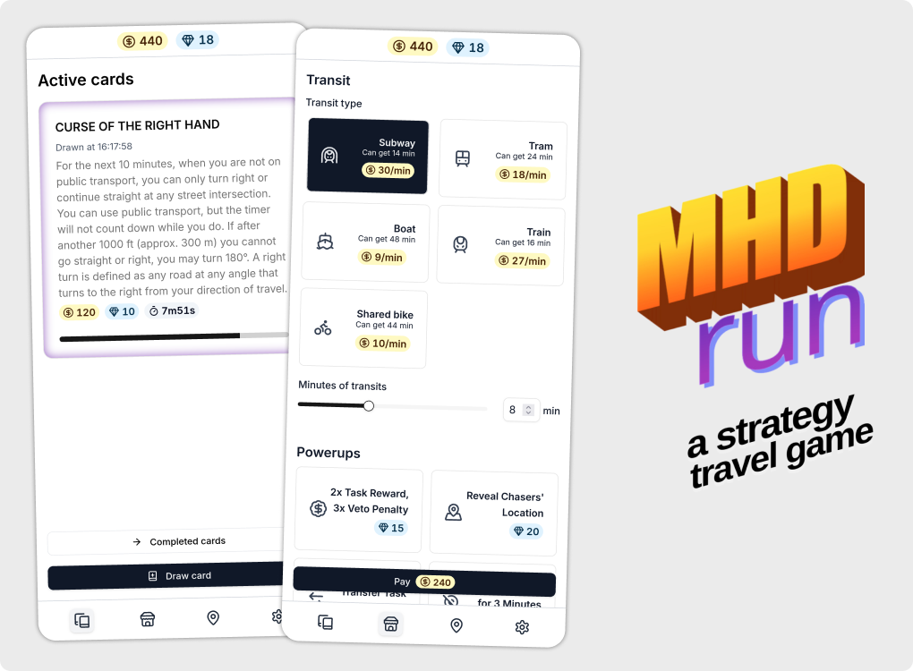

A web app used for my travel game heavily inspired by [Jetlag: The game](https://www.youtube.com/@jetlagthegame). The game is a very dynamic real-time strategy, played in a city with public transit.

_[Try the app](https://mhd-run.vercel.app)_

**Basics of this game:**

1. You complete challenges to get coins
2. The coins can be spent on transit, which you'll use to get to your goal and away from the chasers
3. You either win by getting to you goal location, or you lose if chasers catch you

You can find the whole rules [here](https://github.com/Limit-sest/mhd-run/blob/main/GAME_RULES.md)

## Technical things

- Vue progressive web app
- UI components are from shadcn/ui
- If the data are downloaded, the app can work entirely offline
- It's meant to be used on phones during the game
